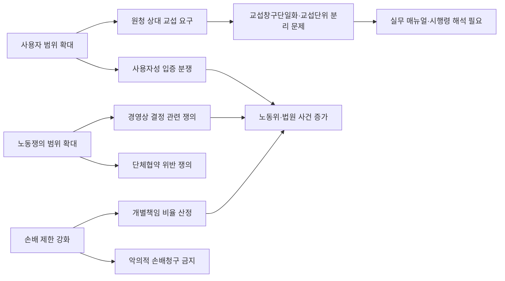

# 대한민국 노조법 제2조·제3조 개정 법률안 종합 보고서

## Executive Summary

최종 업데이트 기준은 **2026년 6월 1일, Asia/Seoul**이다. 이 시점에서 대한민국의 이른바 **노조법 2·3조 개정**은 이미 입법 절차를 마쳐, **법률 제21045호로 2025년 9월 9일 공포**되었고 **2026년 3월 10일부터 시행 중**이다. 핵심은 세 갈래다.

- 첫째, **실질적·구체적으로 근로조건을 지배·결정하는 자**를 노조법상 사용자로 포섭해 원청·간접고용 구조에서의 단체교섭 상대방 범위를 넓혔다.
- 둘째, 노동쟁의 개념을 넓혀 **해고·근로자 지위·사업경영상 결정** 및 일정한 **단체협약 위반**까지 분쟁 대상으로 포함시켰다.
- 셋째, 손해배상 규율을 고쳐 **노동조합 활동 일반**으로 손배 제한 범위를 넓히고, 개별 조합원 책임의 비율 산정·감면, 신원보증인 면책, 악의적 손배권 행사 금지 등을 새로 도입했다.

이 개정은 22대 국회에서 **두 차례의 입법 파동**을 거쳐 성립했다. 2024년의 1차 법안군은 대안반영폐기되었고, 2025년에 다시 발의된 법안군이 **환경노동위원장 대안**으로 묶여 국회를 통과했다. 이후 고용노동부는 **시행령 입법예고·재입법예고**, **해석지침**, **원하청 상생 교섭절차 매뉴얼**을 잇달아 내어 제도 안착을 시도했다. 2026년 5월에는 다시 관련 개정안이 발의되어 후속 수정 입법 논의도 이어지고 있다. 

정책적 평가는 sharply divided 되어 있다. 노동계와 인권·노동법 전문가 그룹은 이 법을 **간접고용·특수고용·플랫폼 노동의 현실에 맞춘 헌법상 노동3권의 실질화**로 본다. 반면 경영계와 보수정당은 **사용자 범위의 불명확성**, **경영권 침해**, **쟁의행위 확산**, **재산권·예측가능성 훼손**을 우려한다. 다만 2023년부터 2025년까지 공식 통계상 **노사분규 발생건수는 오히려 감소 추세**였고, 한국의 **노동조합 조직률은 2024년에도 13.0%에 머물렀다**는 점에서, 이 개정의 실제 효과는 “즉시적인 파업 급증”보다는 **원청 교섭의 제도화**, **사용자성·교섭단위 분쟁의 증가**, **손배소송 구조의 변화**에서 먼저 나타날 가능성이 높다. 이는 본 보고서의 판단이며, 시행 초기 분쟁사례의 축적이 더 필요하다. 

## 입법 경과와 최신 법안 현황

2025년 성립한 개정법의 공식 공포문은 법제처 국가법령정보센터의 **제·개정문**에서 확인된다. 거기에는 **법률 제21045호**, 공포일 **2025년 9월 9일**, 시행일 **2026년 3월 10일**, 그리고 제2조·제3조 개정의 핵심 문언이 모두 수록되어 있다. 현행 시행법 역시 국가법령정보센터에서 동일하게 확인된다. 의원안·위원회대안의 원문은 각 **국회입법현황 상세페이지**에서 HWP/PDF 형태로 제공되며, 해당 상세페이지는 **의안정보시스템**과 **국회입법예고**로의 연결 메뉴를 함께 제공한다.

직접 식별되는 22대 국회 관련 법안군은 크게 **2024년 1차 추진군**, **2025년 재추진군**, **위원회 대안**, **2026년 후속 수정안**으로 나눌 수 있다. 아래 표는 이 가운데 제2조·제3조 개정과 직접 관련된 법안들을 우선 배열한 것이다. 다만 일부 의안은 동일 법률명을 가진 여러 개정안 중에서 **제안이유 전문을 본 환경에서 전부 추출하지 못한 경우**가 있어, “직접 관련” 여부를 의안 제목·상세페이지·처리군 맥락으로 식별했다는 점을 명시한다. 

| 구분       |    의안번호 | 제안자                 | 발의일          | 상임위        | 심사현황                                   |
| -------- | ------: | ------------------- | ------------ | ---------- | -------------------------------------- |
| 2024 1차  | 2200075 | 박해철의원 등 14인         | 2024. 6. 3.  | 환경노동위      | 본회의 심의 후 대안반영폐기                        |
| 2024 1차  | 2200562 | 이용우·신장식·윤종오의원 등 87인 | 2024. 6. 17. | 환경노동위      | 대안반영폐기                                 |
| 2024 1차  | 2200978 | 김주영의원 등 30인         | 2024. 6. 26. | 환경노동위      | 본회의 심의 후 대안반영폐기                        |
| 2025 재추진 | 2208195 | 박홍배의원 등 16인         | 2025. 2. 17. | 환경노동위      | 본회의 심의 후 대안반영폐기                        |
| 2025 재추진 | 2208800 | 김태선의원 등 14인         | 2025. 3. 11. | 환경노동위      | 2025.7.28 위원회 의결 후 대안반영폐기              |
| 2025 재추진 | 2209225 | 박정의원 등 14인          | 2025. 3. 21. | 환경노동위      | 2025.3.24 회부, 7.18 상정, 7.28 처리, 대안반영폐기 |
| 2025 재추진 | 2210488 | 박해철의원 등 13인         | 2025. 5. 12. | 환경노동위      | 대안반영폐기                                 |
| 2025 재추진 | 2211030 | 이용우·신장식·정혜경의원 등 43인 | 2025. 6. 23. | 환경노동위      | 대안반영폐기                                 |
| 위원회 대안   | 2211924 | 환경노동위원장             | 2025. 8. 1.  | 환경노동위      | 2025.8.24 본회의 원안가결, 2025.9.9 공포        |
| 후속 수정안   | 2218912 | 박수민의원 등 10인         | 2026. 5. 11. | 기후에너지환경노동위 | 2026.5.12 위원회 회부, 계류                   |

위 표의 2024년 법안군은 공식 국회입법현황 검색결과와 의안상세 페이지에서 확인되며, 2025년 법안군과 위원회대안, 2026년 후속 수정안 역시 같은 공식 경로에서 확인된다. 특히 위원회 대안은 **2025년 8월 1일 제안**, **2025년 8월 24일 본회의 원안가결**, **2025년 9월 9일 공포**라는 흐름이 분명하다. 

## 조문 비교와 법적 효과

저작권·분량 제한 때문에 아래 비교표는 **전문(全文) 전재가 아니라 최소 인용과 충실한 요약**으로 구성했다. 원문 전문은 현행법의 경우 국가법령정보센터, 각 의원안과 위원회대안은 국회입법현황 의안상세의 **의안원문 PDF/HWP**에서 확인하는 것이 정확하다. 

| 조문          | 개정 전 법리·조문 상태                                          | 개정 후 핵심 문언·구조                                                               | 변경 요지                          | 법적 효과                                                                 |
| ----------- | ------------------------------------------------------ | --------------------------------------------------------------------------- | ------------------------------ | --------------------------------------------------------------------- |
| 제2조 제2호     | 사용자는 원칙적으로 계약상 사용주 중심으로 이해되었고, 원청 사용자성은 주로 판례 법리로 다투어짐 | 계약 당사자가 아니어도 **근로조건을 실질적·구체적으로 지배·결정**할 수 있으면 그 범위에서 사용자                    | 대법원 판례로 전개된 원청 사용자성 법리를 법문에 흡수 | 원하청·간접고용 구조에서 원청 상대 교섭 요구가 가능해짐. 다만 어떤 통제·결정이 “실질적·구체적”인지가 새 핵심 쟁점이 됨 |
| 제2조 제4호 라목  | 비근로자 가입 허용 시 노조법상 노조성 판단에서 불리하게 작용하는 구조가 존재            | 라목 삭제                                                                       | “법외노조” 공격 경로를 축소               | 특수고용·플랫폼·해고자·실업자 관련 조직형태에 유리한 구조                                      |
| 제2조 제5호     | 노동쟁의는 임금·근로시간·복지·해고 기타 대우 등 전통적 근로조건 분쟁 중심             | **근로자의 지위**, **근로조건에 영향을 미치는 사업경영상의 결정**, 일정한 **단체협약 위반**까지 포섭              | 쟁의대상 확대                        | 정리해고·외주화·도급전환·구조조정 등 경영상 결정이 근로조건에 미치는 경우 쟁의 적법성 다툼이 새로 촉발될 가능성       |
| 제3조 제1항     | 손배 제한 범위가 “이 법에 의한 단체교섭 또는 쟁의행위” 중심                    | **이 법에 따른 단체교섭·쟁의행위, 그 밖의 노동조합의 활동**으로 확대                                   | 보호 범위 확대                       | 쟁의행위 여부가 애매한 노조활동도 손배 제한 논리 안으로 들어올 여지 확대                             |
| 제3조 제2항     | 사용자 불법행위에 대한 방어행위 면책 규정 부재                             | 사용자 불법행위에 맞서 노동조합·근로자의 이익을 방위하기 위해 불가피하게 발생한 손해는 면책                         | 방어행위 명문화                       | 사용자 선행위법과 노동조합 대응행위 사이 인과관계가 손배소의 핵심 쟁점이 됨                            |
| 제3조 제3항·제4항 | 불법행위 일반법리에 따라 공동불법행위 책임이 문제 되었고, 개별 조합원 기준은 판례 의존      | 법원이 **지위·역할·참여 정도·기여 정도·임금수준·청구액** 등을 고려해 책임비율을 정하고, 경제상태·부양의무 등을 반영해 감면 가능 | 2023 대법원 판례 취지를 입법화            | 개별 조합원에 대한 과도한 연대손배 구조를 약화                                            |
| 제3조 제5항     | 신원보증인 책임에 대한 특칙 부재                                     | 신원보증인 면책                                                                    | 보증책임 차단                        | 가족·제3자에게 손배 부담이 전가되는 구조 축소                                            |
| 제3조 제6항     | 악의적 손배청구 금지의 명문 부재                                     | 노조 존립을 위태롭게 하거나 운영을 방해할 목적, 조합원 활동을 방해할 목적의 손배권 행사 금지                       | “노조파괴용 손배” 금지                  | 사용자 의도와 권리남용이 새로운 소송 쟁점이 됨                                            |
| 제3조의2 신설    | 사용자의 책임 면제 특칙 부재                                       | 사용자는 손해배상 등 책임을 면제 가능                                                       | 합의·분쟁 종결 수단 마련                 | 장기 분쟁 종결, 화해·조정 여지 확대                                                 |

이 표의 핵심 문언은 공포된 개정문 자체와 현행 시행법, 그리고 2010년·2023년 대법원 판례를 결합해 해석해야 한다. 특히 제2조 제2호의 “실질적·구체적 지배·결정”과 제3조 제3항·제4항의 개별책임 판단 요소는 각각 **대법원 2010.3.25. 선고 2007두8881**과 **대법원 2023.6.15. 선고 2017다46274**의 법리와 강하게 연결된다. 이 점에서 이번 개정은 완전히 새로운 체계라기보다, **기존 판례의 입법화 + 일부 쟁의대상·손배규율의 확장**이라는 성격이 강하다. 이는 본 보고서의 해석이다. 

## 정부 해설과 이해관계자 입장

정부와 행정기관이 2025년 하반기부터 2026년 초까지 내놓은 공식 자료는 세 층위로 나뉜다. 
- 첫째, **법률 통과 직후의 설명자료**다. 고용노동부는 
	- 2025년 7월 31일 환노위 의결 직후 「노동조합법 2·3조 개정 주요 질의답변」을 올렸고,
	- 2025년 8월 24일 본회의 의결 직후에는 '후속계획'을 공표했다. 
- 둘째, **하위법령 정비 자료**다. 고용노동부는 
	- 2025년 11월 25일 시행령·시행규칙 입법예고, 
	- 2026년 1월 21일 시행령 재입법예고, 
	- 2026년 3월 3일 시행령 개정령 공포를 진행했다. 
- 셋째, **집행·해석 자료**다. 
	- 2026년 2월 24~27일 사이에 「개정 노동조합법 해석지침」과 「원하청 상생 교섭절차 매뉴얼」을 확정·배포했고, 
	- 2026년 3월 9일 시행 보도자료에서 '현장 안착 지원 방침'을 다시 밝혔다. 

법제처 계열의 공식 자료로는, 국가법령정보센터의 **현행법령**, **제·개정문**, **신구 비교 체계**, 그리고 법령해석 목록이 중요하다. 새 제2조·제3조 자체에 대한 별도의 공개 법령해석례는 본 조사 범위에서 직접 확인되지 않았지만, 관련 시행령 영역에서는 **법령해석례 23-0819**가 존재하며, 이는 **교섭단위가 분리된 경우 종사근로자인 조합원 수 확인의 기준일**에 관한 해석이다. 즉, 법제처는 새 2·3조 본문보다도 **교섭창구단일화·교섭단위 운영** 같은 하위 절차 문제에서 해석 역할을 수행할 가능성이 크다. 

이해관계자들의 공식 입장도 비교적 선명하다. 노동계는 대체로 이번 개정을 **원청 교섭시대의 개막**으로 평가했다. 민주노총은 환노위 통과 직후 “원청교섭시대, 손배없는 시대”라는 표현으로 환영했고, 본회의 통과 뒤에는 제2조 제2호 사용자 정의 확대와 제3조 손배 제한의 의미를 조목별 설명자료로 배포했다. 한국노총 역시 2025년 2월 발의 기자회견과 7월 국회 대응, 9월 설명자료를 통해 **모든 노동자에게 노동3권 보장**이라는 방향을 강조했다. 

반대로 경영계는 개정안을 강하게 비판했다. 경총은 2025년 7월 환노위 통과 직후 공식 자료에서 이번 개정이 **노사관계에 큰 혼란**을 초래할 수 있다고 했고, 기존의 **「노동조합법 제2조, 제3조 개정안에 대한 경영계 의견」** 자료에서는 사용자 범위 확대, 쟁의대상 확대, 손해배상 제한이 법적 불확실성을 높인다고 주장했다. 재계 논지는 대체로 “누가 사용자냐”, “어디까지가 쟁의 가능한 경영상 결정이냐”, “불법행위 책임이 과도하게 줄지 않느냐”에 집중되어 있다.

정당의 입장도 양분됐다. 더불어민주당은 2025년 7월 공식 논평에서 이번 입법을 **헌법이 보장한 노동 기본권의 실현**으로 규정하며, 하청노동자의 교섭권 보장을 핵심 근거로 들었다. 국민의힘은 2025년 2월과 7월 공식 논평에서 이 법을 **불법파업조장법**, **시장에 족쇄를 채우는 법**이라고 비판하면서, 기업 현장 혼란과 재산권 침해 가능성을 제기했다. 

노동전문가·법률가·학계의 공식·준공식 자료는 보다 미세하다. 민변과 노조법 2·3조 개정운동본부는 2025년 8월 자료집과 입장문에서 경제계와 일부 정치권의 비판을 **과장 또는 왜곡**이라고 반박했다. 반면 경총이 연 토론회에서는 원청 사용자성 확대가 일반적인 원·하청 관계 전체에 적용될 때 노사관계가 불안정해질 수 있다는 취지의 비판이 제기됐다. 한국노동사회연구소는 2025년 9월 포럼에서 **개정 이후 노동조합의 대응과 과제**를 논의 대상으로 삼았고, 한국노동연구원은 2025년·2026년 노사관계 전망 자료에서 노조법 2·3조가 핵심 제도 쟁점으로 남을 것이라고 봤다. 즉 전문가·학계는 일방향으로 수렴하지 않고, **권리보장 필요성과 집행 불확실성**을 동시에 인정하는 구도로 정리된다. 

## 주요 쟁점과 파급효과

가장 큰 쟁점은 제2조 제2호의 **사용자 범위 확대**다. 입법문구는 “근로계약 체결 당사자가 아니더라도” 실질적·구체적으로 근로조건을 지배·결정할 수 있으면 사용자로 본다고 규정한다. 이 문구는 2010년 대법원이 현대중공업 사건에서 제시한 **실질적·구체적 지배·결정** 법리를 거의 그대로 입법문으로 끌어올린 것이다. 따라서 앞으로의 쟁점은 “법리의 존재 여부”가 아니라 “**어떤 수준의 통제·결정이 사용자성을 발생시키는가**”로 이동한다. 근로시간 배치, 작업량·인력운영, 안전·작업방법, 노조활동 시간 보장, 사실상의 인사결정 영향력 등이 구체적 사실로 다투어질 가능성이 높다. 이는 법문과 판례, 그리고 고용노동부 해석지침이 교차하는 영역이다.

두 번째 쟁점은 제2조 제5호의 **노동쟁의 개념 확대**다. 개정법은 임금·근로시간 같은 전통적 근로조건뿐 아니라 **근로자의 지위**, **사업경영상의 결정이 근로조건에 미치는 경우**, 일정한 **단체협약 위반**을 포섭했다. 노동계는 이를 통해 정리해고·외주화·도급전환처럼 “형식상 경영판단이지만 실질적으로는 근로조건을 바꾸는 결정”에 대해 쟁의권을 행사할 수 있는 법적 공간이 넓어진다고 본다. 반면 경영계는 쟁의대상이 지나치게 확대되어, 경영판단 전체가 파업 대상화될 수 있다고 우려한다. 실제 적용에서는 모든 경영상 판단이 곧바로 쟁의대상이 되는 것이 아니라, **근로조건 연계성**과 **교섭가능성**을 어느 정도로 볼 것인지가 법원과 노동위원회에서 핵심 쟁점이 될 가능성이 높다. 이것 역시 본 보고서의 분석적 판단이다. 

세 번째 쟁점은 제3조 개정이 가져올 **손배소 구조 변화**다. 2023년 대법원은 현대자동차 손배 사건에서 개별 조합원 책임을 노동조합과 동일하게 취급해서는 안 되며, **노조 내 지위·역할·참여 경위·손해 기여 정도·임금수준** 등을 고려해야 한다고 판시했다. 이번 개정은 이 판례 요소를 거의 그대로 법률에 반영했다. 따라서 앞으로는 기업이 손배소를 제기하더라도, 개별 조합원마다 책임비율이 다르게 정해질 가능성이 크고, 경제상태·부양의무·최저생계 보장까지 감면사유로 거론될 수 있다. 사용자 측이 노조 붕괴 목적의 손배권 행사를 하면 금지된다는 조항까지 들어갔기 때문에, **권리남용 및 목적 심사**가 새로운 쟁점으로 부상한다. 

네 번째 쟁점은 **사업장 단위와 조직화**다. 고용노동부가 2025년 12월 발표한 2024년 조직현황에 따르면, 전체 노동조합 조직률은 13.0%에 그쳤지만, 300인 이상 사업장은 35.1%, 30인 미만 사업장은 0.1%였고, 전체 조합원 중 59.1%가 초기업노조 소속이었다. 이를 종합하면, 한국의 노조조직은 대기업·공공부문·산별·초기업 조직에 상대적으로 편중되어 있고, 작은 사업장과 외주·간접고용 사슬 말단은 여전히 낮은 조직률을 보인다. 따라서 이번 개정의 실질적 수혜영역은 대규모 정규직 사업장 일반이 아니라, **원청 영향력은 크지만 직접 고용관계는 약한 하청·용역·간접고용 부문**일 가능성이 높다. 이것 역시 통계에 근거한 추론이다. 

다섯 번째 쟁점은 **헌법상 좌표**다. 지지 측은 이번 개정이 헌법 제33조 제1항의 단결권·단체교섭권·단체행동권을 현실화하는 것이고, 대법원 판례와 ILO의 결사의 자유·단체교섭 원칙에 부합한다고 본다. 반대 측은 사용자 범위와 쟁의대상 규정이 모호해 **명확성**, **재산권**, **기업의 자유**, **비례성** 문제가 생길 수 있다고 본다. 실제로는 법률 자체의 위헌성보다, 구체적 사안에서 법원이 “**실질적·구체적 지배**”와 “**근로조건에 영향을 미치는 사업경영상 결정**”을 어느 정도로 좁히거나 넓히는지가 헌법적 긴장을 흡수하는 방식이 될 가능성이 높다. 

아래 도식은 쟁점들의 상호작용을 요약한다.

## 판례와 학술, 국제비교와 통계

판례 차원에서 보면, 이번 개정은 두 축의 사법법리를 거의 전면적으로 흡수했다. 
하나는 **대법원 2010.3.25. 선고 2007두8881**로 대표되는 원청 사용자성 법리다. 이 판결은 원청이 하청노동자의 기본적 노동조건을 **실질적·구체적으로 지배·결정**할 수 있으면 부당노동행위 구제명령의 대상인 사용자에 해당한다고 보았다. 
다른 하나는 **대법원 2023.6.15. 선고 2017다46274**로 대표되는 손해배상 책임제한 법리다. 이 판결은 위법한 쟁의행위에서도 책임의 원칙적 귀속주체는 노조이지만, 개별 조합원의 책임은 일률적으로 동일하게 볼 수 없고, 지위·역할·참여 경위·기여 정도·임금수준 등을 종합 고려해야 한다고 판시했다. 입법자는 사실상 이 두 판례를 제2조와 제3조에 “법조문화”했다.

학술·연구자료도 이 방향을 대체로 확인한다. 울산대 소속 연구 논문은 2025년 개정 이후의 쟁점을 정리하면서 사용자 범위, 노동쟁의 범위, 손배 제한을 핵심 항목으로 제시했고, 한국노동연구원의 2025년·2026년 노사관계 전망 자료 역시 노조법 2·3조를 지속적 분쟁 변수로 보았다. 한국노동사회연구소는 개정 이후 노동조합의 대응과 과제를 독자 포럼 주제로 다루었다. 즉 학술·연구 영역의 공통분모는 “개정의 방향 자체는 이해하더라도, 실제 분쟁은 **사용자성 입증**, **교섭단위**, **손배 감면 기준**에서 집중될 것”이라는 데 있다. 

국제비교는 신중해야 한다. 한국 개정은 외국법의 특정 문구를 그대로 옮겼다기보다, **국제노동기준과 여러 나라의 집단노동법 현실**을 한국적 구조에 맞게 조정한 결과에 가깝다. 
ILO 협약 제87호와 제98호는 결사의 자유와 단체교섭 촉진을 핵심 원칙으로 삼지만, 한국식의 “원청 사용자성”이나 “손배 제한” 문장을 직접 규정하지는 않는다. 
미국은 2026년 현재 연방 차원에서 오히려 **더 좁은 공동사용자 기준**으로 회귀하는 흐름이 강하며, 2023년 NLRB 기준은 2026년 연방 관보 조치로 철회되었다. 
일본 노동조합법은 법 목적에서 **사용자와의 교섭을 통한 노동자 지위 향상**과 **집단행동 보호**를 명시하고 있으나, 본 조사에서 확보된 공식 일본 법원·행정해석 자료만으로 한국 개정과 1:1 대응되는 “원청 사용자성” 법리를 단정하기는 어렵다. 
따라서 비교법적으로는 한국이 **노동권 보장 측면에서는 ILO 친화적**, **공동사용자 범위 측면에서는 최근 미국보다 넓을 가능성**, **법문 구조는 일본식 일반 원칙보다 더 구체적**이라고 정리하는 것이 가장 안전하다. 

통계는 이 법 개정의 필요성과 효과를 읽는 데 중요하다. 먼저 노동조합 조직률은 2022년 **13.1%**, 2023년 **13.0%**, 2024년 **13.0%**다. 즉 한국은 장기적으로 여전히 **낮은 조직률 국가**이고, 특히 소규모 민간사업장 조직률이 극히 낮다.

이 수치는 고용노동부 공식 발표와 e-나라지표를 기준으로 정리했다. 

참고로 e-나라지표는 한국의 2024년 노조 조직률을 13.0%로 제시하면서, 비교대상 국가 중 미국 9.9%, 영국 22.0%, 일본 16.2%, 대만 33.4%라고 설명한다. 국제 비교 수치는 제도 차이와 단체협약 효력범위 차이를 감안해 해석해야 하지만, 적어도 한국이 OECD 및 주변국 대비 “낮은 조직률·좁은 협약 포괄력” 구조라는 점은 유지되고 있다고 볼 수 있다.