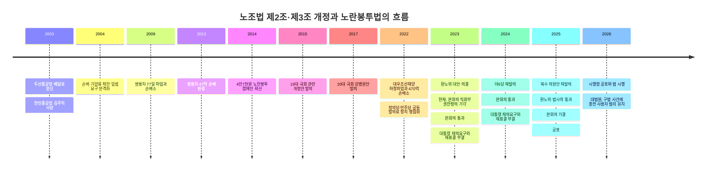

# 대한민국 노조법 제2조·제3조 개정 법률안과 노란봉투법의 입법 과정

## Executive summary

이른바 ‘노란봉투법’은 독립된 별도 법률명이 아니라, 「노동조합 및 노동관계조정법」 제2조·제3조를 중심으로 한 개정 입법을 가리키는 정치·언론적 명칭이다. 이 개정은 사용자 개념을 넓혀 간접고용·원하청 관계에서 실질적 지배력을 가진 원청의 책임을 강화하고, 노동쟁의의 대상을 확대하며, 노동조합 활동과 쟁의행위를 둘러싼 손해배상·가압류를 제한하는 데 핵심이 있다. 이 개정은 2023년과 2024년 두 차례 국회 본회의를 통과하고도 대통령 재의요구권 행사와 재표결 부결로 폐기되었으나, 2025년 다시 가결·공포되어 2026년 3월 10일부터 시행 중이다. 

이 입법의 역사적 배경은 단순한 조문 수정보다 훨씬 길다. 2003년 두산중공업 배달호 조합원 분신, 같은 해 한진중공업 김주익 지회장 사망, 2009년 쌍용자동차 정리해고 반대 파업 이후 거액 손해배상 판결, 2013~2014년 ‘4만7천원 노란봉투’ 시민 모금, 2022년 대우조선해양 하청노동자 파업과 470억 원 손배소 제기 등이 누적되면서 “손배·가압류가 노동3권을 과도하게 위축시킨다”는 문제의식이 입법 의제로 굳어졌다. 

쟁점은 지금도 끝나지 않았다. 찬성론은 헌법상 노동3권의 실효성, 원청의 책임과 권한의 일치, 과도한 손배 청구의 억제를 강조한다. 반대론은 사용자 개념과 노동쟁의 범위의 불명확성, 불법파업 유인, 재산권과 기업 경영의 자유 침해 가능성을 제기한다. 2026년 5월 대법원 전원합의체가 개정 전 사건에서 구법상 원청의 단체교섭의무를 부정한 판결을 내린 점은, 개정법 시행 이후에도 법원·노동위원회가 새로운 문언을 어떻게 구체화할지가 여전히 핵심 과제임을 보여준다. 

## 개요

2026년 6월 1일 현재 기준으로, 노조법 제2조·제3조 개정은 이미 “법률안” 단계가 아니라 법률 제21045호로 공포되어 시행 중이다. 따라서 아래에서는 먼저 **현행 조문**을 제시하고, 이어서 입법 당시 주요 **발의안과 대안**이 어떤 방식으로 조문을 바꾸려 했는지 비교한다. 

### 현행 제2조 원문

> **제2조(정의)** 이 법에서 사용하는 용어의 정의는 다음과 같다.  
> 1. “근로자”라 함은 직업의 종류를 불문하고 임금·급료 기타 이에 준하는 수입에 의하여 생활하는 자를 말한다.  
> 2. “사용자”라 함은 사업주, 사업의 경영담당자 또는 그 사업의 근로자에 관한 사항에 대하여 사업주를 위하여 행동하는 자를 말한다. **다만, 근로계약 체결의 당사자가 아니더라도 근로자의 근로조건에 대하여 실질적이고 구체적으로 지배·결정할 수 있는 지위에 있는 자는 그 범위에서 사용자로 본다.**  
> 3. “사용자단체”라 함은 노동조합에 대하여 사용자로서의 권한을 행사하거나 그 권한행사를 위하여 조직된 단체를 말한다.  
> 4. “노동조합”이라 함은 근로자가 주체가 되어 자주적으로 단결하여 근로조건의 유지·개선 기타 근로자의 경제적·사회적 지위의 향상을 도모함을 목적으로 조직하는 단체 또는 그 연합단체를 말한다. 다만, 다음 각 목의 어느 하나에 해당하는 경우에는 노동조합으로 보지 아니한다.  
> 5. “노동쟁의”라 함은 **노동조합과 사용자 또는 사용자단체 사이에 근로조건의 결정, 근로자의 지위 또는 대우에 관한 주장불일치로 인하여 발생한 분쟁상태를 말하며, 근로조건에 영향을 미치는 사업경영상의 결정에 관한 주장불일치로 인하여 발생한 분쟁상태 및 제92조제2호가목부터 라목까지의 사항에 관한 사용자의 명백한 단체협약 위반으로 인하여 발생한 분쟁상태를 포함한다.**

위 문언은 2025년 9월 9일 공포, 2026년 3월 10일 시행된 현행 법률의 조문이다. 특히 제2조 제2호 단서의 사용자 확장, 제2조 제5호의 노동쟁의 범위 확대가 핵심이다. 

### 현행 제3조 원문

> **제3조(손해배상 청구의 제한)**  
> ① 사용자는 이 법에 따른 단체교섭 또는 쟁의행위, 그 밖의 노동조합의 활동으로 인하여 손해를 입은 경우에 노동조합 또는 근로자에 대하여 그 배상을 청구할 수 없다.  
> ② 사용자의 불법행위에 대하여 노동조합 또는 근로자의 이익을 방위하기 위하여 부득이 사용자에게 손해를 가한 노동조합 또는 근로자는 배상할 책임이 없다.  
> ③ 법원은 제1항 각 호 외의 부분 또는 제2항에도 불구하고 사용자의 청구에 따라 손해배상책임을 인정하는 경우, 손해의 배상의무자인 근로자에 대하여 노동조합에서의 지위와 역할, 쟁의행위 등 참여 경위 및 정도, 손해 발생에 대한 관여의 정도, 임금 수준과 손해배상 청구금액, 그 밖의 사정을 고려하여 귀책사유와 기여도에 따라 책임 비율을 정하여야 한다.  
> ④ 노동조합 또는 근로자는 손해배상액의 감면을 청구할 수 있고, 법원은 배상의무자의 경제상태, 부양의무 등 가족관계, 최저생계비 보장 및 존립 유지 등을 고려하여 각 배상의무자별로 감면 여부 및 정도를 판단할 수 있다.  
> ⑤ 「신원보증법」에도 불구하고 신원보증인은 단체교섭 또는 쟁의행위, 그 밖의 노동조합의 활동으로 인하여 발생한 손해에 대하여 배상할 책임이 없다.  
> ⑥ 사용자는 노동조합의 존립을 위태롭게 하거나 운영을 방해할 목적 또는 조합원의 노동조합 활동을 방해하고 손해를 입히려는 목적으로 손해배상청구권을 행사하여서는 아니 된다.  
> ⑦ 사용자는 노동조합의 존립을 위태롭게 하거나 운영을 방해할 목적 또는 조합원의 노동조합 활동을 방해하고 손해를 입히려는 목적으로 가압류를 신청하여서는 아니 된다. 

이번 개정으로 제3조의2(책임의 면제)도 신설되었다. “사용자는 단체교섭 또는 쟁의행위, 그 밖의 노동조합의 활동으로 인한 노동조합 또는 근로자의 손해배상 등 책임을 면제할 수 있다”는 조항이다. 이 조항은 제3조 본문보다 덜 주목받았으나, 22대 국회 재발의 과정에서 “더 강화된 안”을 보여주는 요소였다.

### 조문별 핵심 비교

| 조문·쟁점 | 개정 전 구법 요지 | 21대 대안 2123038 | 22대 대안 2202444 | 최종 성립법 2211924 → 법률 제21045 |
|---|---|---|---|---|
| 제2조 제2호 사용자 | 근로계약상 사용자 중심. 원청 사용자성은 판례와 노동위원회 해석에 크게 의존 | “실질적·구체적 지배·결정” 사용자 문구 도입 | 동일한 방향 유지 | 동일 문구가 현행법에 반영 |
| 제2조 제4호 라목 | “근로자가 아닌 자의 가입을 허용하는 경우” 노동조합으로 보지 않음 | 유지 | 삭제 방향이 쟁점화 | 현행법에서 삭제 반영 |
| 제2조 제5호 노동쟁의 | “근로조건의 결정”에 관한 주장불일치 중심 | 사용자 부당노동행위·단체협약 불이행 등 확대 논의 | 근로자의 지위·대우, 사업경영상 결정, 명백한 단협위반까지 확대 | 현행법에 확대 반영 |
| 제3조 손배 제한 | 정당한 단체교섭·쟁의행위에 대한 일반적 민사면책만 존재 | 배상의무자별 귀책사유·기여도 개별화 도입 | 손배 제한 범위와 감면 구조 강화 | 귀책비율·감면·신원보증인 면책·남용 목적 손배·가압류 금지까지 반영 |
| 제3조의2 | 없음 | 없음 | 신설 논의 본격화 | 신설되어 현행법 반영 |

이 비교는 법제처의 구법·현행 조문, 21대 환노위 대안, 22대 야6당 공동안과 환노위 대안, 2025년 최종 대안을 대조한 것이다. 엄밀히 말해 21대안과 22대안 사이에는 “원청 사용자성 도입”이라는 연속성이 있었고, 22대안에서는 노조의 법적 요건과 손배 면제구조가 더 넓어졌다. 

## 노란봉투법

‘노란봉투법’이라는 명칭은 2013년 12월 시민 배춘환씨가 쌍용자동차 해고노동자들에게 47억 원 손해배상 판결이 내려졌다는 보도를 읽고 4만7천 원을 시사IN에 보낸 편지에서 유래했다. 이 사연이 공개된 뒤 시사IN과 아름다운재단의 모금 캠페인으로 확장되었고, 2014년 2월 10일부터 5월 30일까지 4만7547명이 14억6874만 원을 모았다. 이후 “손배·가압류로 노동3권이 위축되는 현실을 바꾸자”는 입법 요구가 ‘노란봉투법’이라는 이름으로 통용되었다. 

정의상 노란봉투법은 보통 **노조법 제2조·제3조 개정안**을 뜻하지만, 22대 국회 이후의 실제 법안 구성은 제2조 제4호 라목 삭제 및 제3조의2 신설까지 포함해 더 넓은 조문 묶음으로 발전했다. 따라서 정치적 별칭은 ‘2·3조 개정’이지만, 실정법상 결과물은 **제2조·제3조·제3조의2, 그리고 제2조 제4호 라목 삭제**를 함께 포함하는 패키지라고 보는 것이 정확하다. 

### 관련 법안 목록

| 의안번호    | 발의자·발의일                          | 법안 요약                                     | 처리결과    |
| ------- | -------------------------------- | ----------------------------------------- | ------- |
| 1917406 | 이인영 의원 등 17인, 2015.10.27         | 손해배상·가압류 제한을 중심으로 한 19대 국회 초기형 노란봉투 입법    | 임기만료 폐기 |
| 2005157 | 강병원 의원 등 24인, 2017.01.18         | 노동조합 손배 책임 상한·개인 책임 문제를 본격 제기             | 대안반영폐기  |
| 2116503 | 이수진 의원 등 13인, 2022.07.18         | 사용자 범위 확대·쟁의범위 확대·손배 제한을 담은 21대 핵심안 중 하나  | 대안반영폐기  |
| 2117135 | 윤미향 의원 등 10인, 2022.09.15         | 정의당 주도, 민주당 다수 동참. ‘노란봉투법’ 명칭이 대중정치에서 본격화 | 대안반영폐기  |
| 2123038 | 환경노동위원장, 2023.06.30              | 21대 환노위 대안. 2023년 본회의 통과 후 재의요구·재표결 부결    | 폐기      |
| 2200562 | 이용우·신장식·윤종오 의원 등 87인, 2024.06.17 | 야6당 공동 발의. 21대안보다 강화된 22대 핵심 재발의안         | 대안반영폐기  |
| 2200978 | 김주영 의원 등 30인, 2024.06.26         | 손배 제한 정교화와 제3조의2 신설 논의를 분명히 한 보완안         | 대안반영폐기  |
| 2202444 | 환경노동위원장, 2024.07.31              | 22대 첫 환노위 대안. 본회의 통과 뒤 재의요구·재표결 부결        | 폐기      |
| 2211030 | 이용우·신장식·정혜경 의원 등 43인, 2025.06.23 | 2025년 재추진 과정의 주요 원안 중 하나                  | 대안반영폐기  |
| 2211924 | 환경노동위원장, 2025.08.01              | 2025년 최종 위원회 대안. 8월 24일 본회의 가결, 9월 9일 공포  | 성립·시행   |

2025년 최종 대안(2211924)은 단일 법안이 아니라 여러 원안을 병합 조정한 위원회 대안으로 보인다. 확인 가능한 자료상 박홍배안(2208195), 김태선안(2208800), 박정안(2209225), 박해철안(2210488), 이용우·신장식·정혜경안(2211030), 이수진안(2211108·2211111) 등이 함께 심사된 것으로 나타난다. 다만 이 병합 목록은 국회 회의자료·대안 PDF·보조 빌트래커를 교차확인한 것이므로, 세부 조문별 기여관계는 원의안 원문 대조가 필요하다. 

### 발의 경위와 국회 심사·표결 이력

2022년 대우조선해양 하청노조 파업과 손배소 예고는 노란봉투법 논의를 다시 전국적 의제로 끌어올렸다. 그 직후 정의당 주도 안이 2022년 9월 발의되고, 국가인권위원회도 2023년 1월 국회에 사용자 개념 확대와 손배가압류 제한 필요성을 의견표명했다. 21대 국회에서는 2023년 2월 환노위 법안소위와 전체회의를 거쳐 법안이 대안으로 정리되었고, 5월 본회의 직회부, 10월 헌법재판소의 직회부 권한쟁의 기각, 11월 9일 본회의 통과, 12월 1일 대통령 재의요구, 12월 8일 재표결 부결로 이어졌다. 

22대 국회에서는 2024년 6월 야6당이 다시 공동발의했고, 7월 환노위·법사위를 거쳐 8월 5일 본회의에서 재석 179명 중 찬성 177명, 반대 2명으로 가결되었다. 그러나 8월 16일 재의요구권이 행사되었고, 9월 26일 재표결에서 찬성 183, 반대 113, 무효 2, 기권 1로 부결되었다. 2025년에는 다시 다수 의원안이 제출되었고, 7월 28일 환노위, 8월 1일 법사위를 거쳐 8월 24일 본회의에서 재석 186명 중 찬성 183명, 반대 3명으로 가결되었다. 이후 9월 2일 국무회의 의결, 9월 9일 공포, 2026년 3월 10일 시행으로 입법이 완료되었다. 

### 찬반 논리 요약

찬성 측 논리는 대체로 네 갈래였다.
- 첫째, 실제로 근로조건을 좌우하는 원청이 교섭책임을 지지 않는 현행 구조는 간접고용 노동자의 단체교섭권을 공허하게 만든다는 주장이다.
- 둘째, 손배·가압류가 단순한 피해 회복을 넘어 노조 와해 수단으로 작동해 노동3권을 위축시킨다는 지적이다.
- 셋째, 국가인권위원회가 밝힌 것처럼 거액 손배와 가압류는 생존권·정신건강 문제까지 야기해 인권침해적 효과를 낳는다는 평가다.
- 넷째, 2025년 정부는 이 법을 “권한과 책임의 일치”, “대화 촉진법”으로 설명하며 원청에 일률적 교섭의무가 생기는 것은 아니라는 점을 강조했다. 

반대 측 논리도 분명했다. 
- 2023년 정부의 재의요구 설명자료는 사용자 개념과 노동쟁의 범위 확장이 산업현장과 국민경제에 중대한 부작용을 가져올 수 있다고 보았다. 
- 경제6단체는 사용자 범위와 노동쟁의 개념이 모호해 공급망 전체에 교섭·쟁의가 확산될 수 있고, 경영상 결정이 광범위한 쟁의 대상으로 변하면 노사 불확실성이 커진다고 주장했다. 
- 보수적 학술논의 일부도 재산권과 기업의 자유, 명확성 원칙, 공동불법행위 책임법리와의 충돌을 제기했다. 

## 연대기

아래 연표는 손배·가압류 문제의 사회화, 노란봉투 캠페인의 상징 형성, 21·22대 국회의 반복된 통과와 거부권 정치, 그리고 2026년 시행 이후 판례 형성까지를 하나의 흐름으로 정리한 것이다. 연표의 각 사건은 기사·공식문서·판결자료를 상호 대조해 추린 것이다. 

연대기의 세부 흐름은 비교적 명확하다. 2003년 두산중공업 배달호 조합원 분신과 한진중공업 김주익 지회장 사망은 손배·가압류 문제가 단순한 민사책임이 아니라 노동운동 전반을 위축시키는 수단이라는 인식을 노동계 안팎에 남겼다. 2004년에는 손배 제한 입법 요구가 본격화되었고, 2009년 쌍용차 파업 이후 거액 손배소가 이어지면서 “정리해고 반대 파업과 손배 폭탄”이 상징적 결합을 이루었다. 2013년 말 쌍용차 손배 판결에 대한 시민 모금이 2014년 노란봉투 캠페인으로 확장되면서, 상징이 제도 개혁 요구로 변환되었다. 

이후 2015년과 2017년의 입법 시도는 성사되지 못했지만, 2022년 대우조선해양 하청파업과 470억 원 손배소 제기가 다시 국면을 바꾸었다. 2023년에는 국가인권위 의견표명, 환노위 의결, 본회의 직회부, 헌재의 절차 적법 판단, 본회의 가결과 거부권, 재표결 부결이 이어졌고, 2024년에도 거의 같은 패턴이 반복되었다. 결정적 변화는 2025년이었다. 다수 원안이 다시 제출된 뒤 위원회 대안으로 정리되어 본회의를 통과했고, 정부는 후속 시행령·해석지침 마련으로 방향을 전환했다. 2026년 시행 후에는 구법 사안에 대한 대법원 전원합의체 판결이 나오면서, 신·구법의 경계와 개정법의 실제 파급범위를 둘러싼 새로운 해석 단계로 넘어갔다.

## 사건·사고

노란봉투법의 역사는 “조문 개정의 역사”이면서 동시에 “손배·가압류와 간접고용 구조가 만들어 낸 사건들의 역사”였다. 아래 사건들은 입법 논의에서 반복적으로 호출된 대표 사례들이다. 일부 초기 사건의 금액과 압류 범위는 보도 시점과 소송 단계에 따라 다소 차이가 있어, 표에서는 확인 가능한 핵심치만 정리했다. 

| 날짜                                | 사건                         | 당사자                     | 결과                                                                                           | 입법사적 의미                                  |
| --------------------------------- | -------------------------- | ----------------------- | -------------------------------------------------------------------------------------------- | ---------------------------------------- |
| 2003.01.09                        | 두산중공업 배달호 조합원 분신           | 두산중공업, 금속노조 두산중공업지회     | 손배·가압류 압박 속 분신 사망. 노동계는 65억 손배, 53억 임금 가압류를 상징적 수치로 제시                                       | 손배·가압류 문제가 전국적 노동의제로 부상                  |
| 2003.10.17                        | 한진중공업 김주익 지회장 사망           | 한진중공업, 금속노조 한진중공업지회     | 85호 크레인 농성 중 사망. 사측은 7억4천여만 원 손배소와 추가 150억 원대 압박이 보도됨. 이후 11월 합의로 손배가압류 취하                   | 손배가압류가 노조탄압 수단으로 기능한다는 인식 강화             |
| 2009.05~08                        | 쌍용자동차 77일 파업               | 쌍용차, 금속노조 쌍용차지부, 경찰     | 회사·국가 손배소가 이어졌고, 이후 ‘47억 손배’가 노란봉투 상징이 됨. 2023년 회사 손배 사건은 파기환송, 2024년 국가 손배 사건은 노동자 일부 배상 확정 | 노란봉투법의 직접적 상징 사례                         |
| 2013.12~2014.05                   | 노란봉투 캠페인                   | 시민 배춘환, 시사IN, 아름다운재단    | 4만7천원 기부에서 시작, 4만7547명 참여·14억6874만 원 모금                                                      | ‘손배 문제’가 시민사회 입법의제로 전환                   |
| 2022.06.02~07.22  / 2022.08.26 | 대우조선해양 하청노조 파업과 470억 손배소   | 대우조선해양, 금속노조 거통고 조선하청지회 | 51일 파업 후 회사가 470억 손배소 제기, 손실 8천억 원 주장. 2025년 형사 1심 일부 집유, 2025년 10월 회사가 손배소 취하               | 21·22대 노란봉투법 재추진의 직접적 촉발점                |
| 2026.05.21                        | HD현대중공업 사내하청 단체교섭 사건 전원합의체 | 금속노조, HD현대중공업           | 구법 사건에 대해 원청의 단체교섭의무 부정, 종전 법리 유지                                                            | 개정법 시행 이후에도 신·구법 경계와 사용자성 판단이 계속 쟁점임을 확인 |

이 사건들을 관통하는 구조는 세 가지다.
- 첫째, 손배·가압류는 파업의 후속 민사책임을 넘어 생활임금·주거·가족 생계에 직접 영향을 미치는 수단으로 작동했다.
- 둘째, 원하청 구조에서는 실제 근로조건을 좌우하는 주체와 형식상 근로계약 상대방이 달라 교섭책임이 공백화되었다.
- 셋째, 법원은 오랫동안 “근로계약 관계”와 “정당한 쟁의행위”를 엄격하게 보아 왔고, 입법은 이 판례 지형을 수정·보완하려는 방향으로 제기되었다. 

## 쟁점 분석

개헌 논의가 아닌 단순한 법률 개정처럼 보이지만, 실질적으로 노란봉투법은 **헌법적 가치충돌**, **노동법 체계 재배치**, **민형사 책임체계 조정**을 동시에 건드렸다. 2023년 정부 재의요구서, 국가인권위 성명, 노동·경영계 성명, 그리고 2026년 대법원 판결을 함께 보면, 입법 논쟁의 핵심은 “누가 진짜 사용자이며, 어떤 분쟁을 집단적으로 다룰 수 있고, 불법성이 인정될 때 손해를 어디까지 누가 부담할 것인가”라는 세 질문으로 압축된다. 

헌법적 차원에서 찬성론은 헌법 제33조의 단결권·단체교섭권·단체행동권의 실효성을 강조한다. 특히 간접고용 노동자의 경우 원청이 실질적으로 권한을 행사하면서도 법적 사용자 책임을 지지 않으면 단체교섭권이 사실상 무력화된다는 논리다. 반면 반대론은 재산권, 기업의 자유, 명확성 원칙을 근거로 사용자 개념 및 노동쟁의 개념이 지나치게 불명확하면 예측가능성을 해친다고 비판한다. 국가인권위는 개정 필요성을 공개 지지했지만, 정부는 2023년 재의요구 당시 심각한 부작용을 우려했다. 즉, 이 법은 **헌법 내부의 가치조정 문제**로 이해하는 편이 정확하다.

노동법적 쟁점은 더 구체적이다. 제2조 제2호의 핵심 문구인 “실질적이고 구체적으로 지배·결정할 수 있는 지위”는 2010년 대법원이 지배·개입형 부당노동행위 사건에서 사용한 법리를 입법화한 측면이 있다. 다만 2026년 5월 전원합의체는 **개정 전 사건**에 대해서는 종전의 근로계약 중심 법리를 유지했다. 이는 개정법이 판례를 “확인”한 것이 아니라, 적어도 단체교섭의무 영역에서는 기존 판례지형을 넘어서는 새 규범을 도입한 것임을 뜻한다. 따라서 시행 이후 쟁점은 “실질적 지배력의 구체적 판단 기준”, “교섭의제의 범위”, “원청-복수 하청-교섭창구단일화의 절차 설계”로 이동했다. 정부가 시행령과 해석지침을 별도로 정비한 이유도 여기에 있다. 

민사·형사법 측면에서는 제3조가 가장 논쟁적이다. 개정법은 손배 불가의 범위를 “단체교섭 또는 쟁의행위”에서 “그 밖의 노동조합의 활동”까지 넓히고, 사용자 불법행위에 대한 방위 목적 손해는 배상책임을 부정하며, 법원에 개인별 책임비율과 감면 판단을 요구한다. 그러나 **모든 민형사책임을 일괄 면제하는 법은 아니다**. 대우조선해양 하청파업 관련 형사 1심이 2025년에도 선고된 점은, 개정법이 민사상 손배 구조를 바꾸더라도 업무방해 등 형사책임과 다른 민사 쟁점까지 자동으로 소멸시키지는 않는다는 사실을 보여준다. 이 때문에 노동계는 “아직 불충분하다”고 보고, 경영계는 “그래도 과도하다”고 본다.

예상 효과는 이해관계자별로 다르다. 노동조합에는 원청과의 교섭 통로가 넓어지고, 손배·가압류의 위축 효과가 줄어들 가능성이 있다. 사용자·기업 특히 제조업 원하청 체계에서는 교섭상대가 증가하고, 경영상 결정 일부가 집단적 분쟁의 대상이 될 수 있어 내부 의사결정과 대관·노무관리 비용이 높아질 수 있다. 법원과 노동위원회에는 사용자성·노동쟁의 범위·감면 판단을 둘러싼 기준 정립 부담이 커질 전망이다. 노동시장 전체로 보면, 단기적으로는 분쟁 건수와 법리 다툼이 늘 수 있으나, 장기적으로는 “실제 결정권자와 실제 교섭상대의 일치”가 정착될 경우 오히려 사후 소송보다 사전 교섭을 촉진할 가능성도 있다. 이는 어디까지나 현재 자료를 바탕으로 한 분석적 추정이며, 2026년 시행 초기 단계여서 실증적 평가는 아직 이르다. 

국제 비교도 흥미롭다. ILO의 결사의 자유 원칙은 파업권 보호와 함께, 분쟁과 무관하게 과도하거나 비례성을 잃은 손해배상·제재는 바람직하지 않다는 방향을 제시한다. 영국은 「Trade Union and Labour Relations (Consolidation) Act 1992」 제219조에서 trade dispute에 관하여 일정한 불법행위 책임으로부터 노조를 면책한다. 반면 미국의 간접고용 책임은 ‘joint employer’ 법리를 통해 다뤄지지만, 2023년 NLRB의 확장 규칙은 2024년 법원에 의해 무효화되었고, 2026년 2월 연방관보를 통해 종전의 더 좁은 기준이 복원되었다. 요약하면 한국의 2025년 개정은 **간접고용 사용자 책임의 입법 명문화 측면에서는 현행 미국 연방법보다 넓고**, **집단행동에 대한 민사면책의 취지 면에서는 영국식 trade dispute immunity와 부분적으로 닿아 있으나**, 여전히 형사책임·업무방해 실무가 강하게 작동하는 한국적 특성이 남아 있다. 

## 결론 및 정책적 시사점

노란봉투법을 둘러싼 20여 년의 흐름은 결국 두 문제를 드러낸다. 
- 첫째, 한국 노사관계에서 손해배상·가압류는 단지 불법행위 사후구제 수단이 아니라 노조 활동을 구조적으로 위축시키는 통치기술로 기능해 왔다. 
- 둘째, 원하청·간접고용 구조가 확대된 현실에서 근로계약 당사자만을 사용자로 보는 법체계는 단체교섭권의 실효성을 떨어뜨려 왔다. 

2025년 개정은 이 두 문제에 대한 입법부의 명시적 응답이었다고 평가할 수 있다. 다만 정부·경영계가 제기한 명확성, 예측가능성, 산업현장 혼란 우려 역시 가볍게 볼 수 없고, 실제로 2026년 시행 초기에는 법원·노동위원회가 새로운 기준을 형성하는 전환 비용을 치를 가능성이 높다. 

정책적으로는 세 가지 시사점이 중요하다. 
- 첫째, 원청 사용자성 판단 기준과 교섭 절차는 시행령·해석지침·노동위원회 판정례를 통해 최대한 투명하게 축적되어야 한다. 
- 둘째, 손배 제한 입법과 형사처벌·가처분·업무방해 실무 사이의 정합성을 점검하지 않으면 현장 체감효과가 반감될 수 있다. 
- 셋째, 시행 초기의 사건 자료를 체계적으로 축적해 분쟁 증가 여부, 교섭 촉진 효과, 법원의 책임감면 실무가 어떤 방향으로 굳는지 사후평가해야 한다. 

현재까지 확인되는 자료만으로 보면, 개정법은 **노동3권의 실질화라는 방향성은 분명하지만**, 그 운영 성패는 앞으로의 해석·판정·판례 형성에 크게 좌우된다. 바로 이 점이 2026년 6월 현재 가장 중요한 불확실성이다.